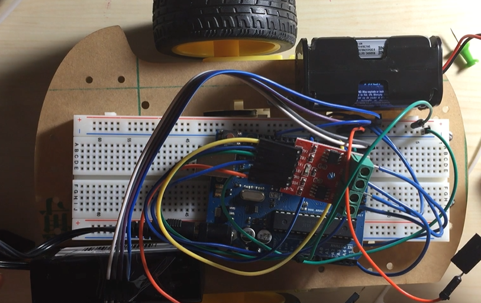

# RemoteControlledCar

The remote controlled car was developed using Arduino UNO, L9110S Dual Motor Driver Module (H-bridge), DC Brush motor, HC05(Bluetooth Module) and an Android phone as the remote.
Batteries are used to power the motors and the MCU.
The android phone is connected to the car via the bluetooth module and each command(forward, reverse, right, left) is stored as a separate number and is implemented as soon as it
is sent from the remote.

The Virtual Circuit of my Remote Controlled car looks like-

The Physical Circuit is as follows-

A demonstration of my car in action-

